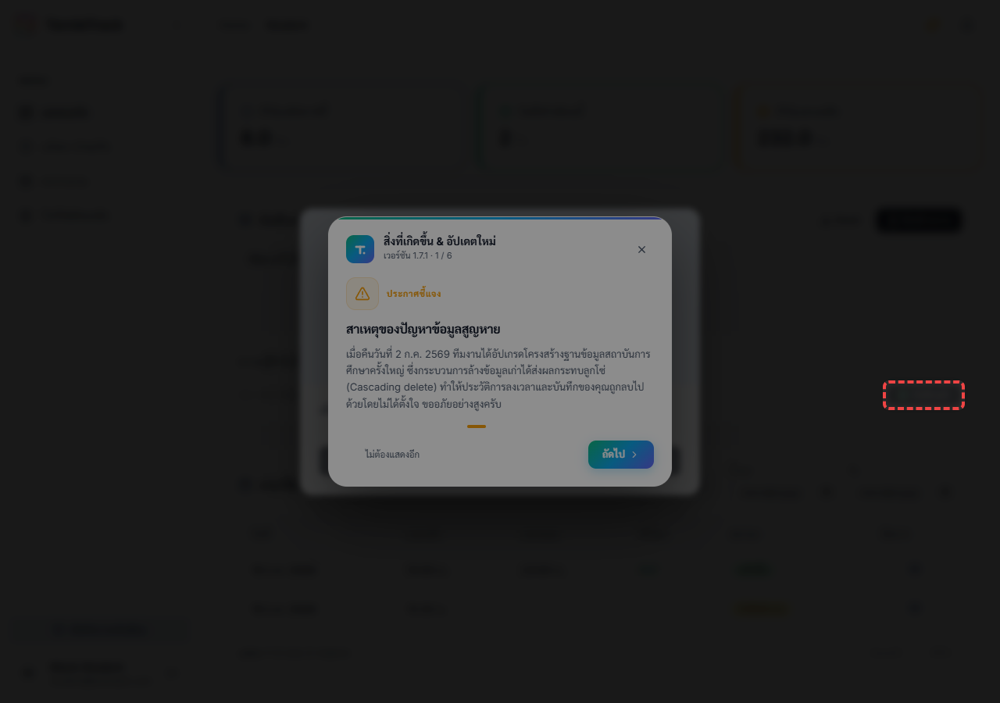
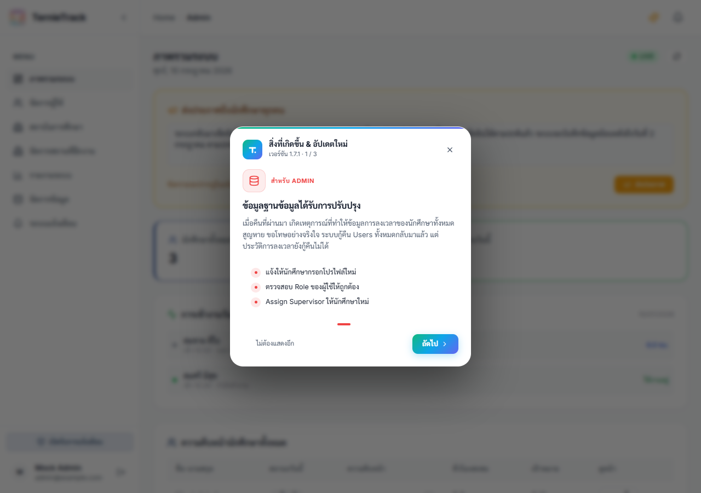
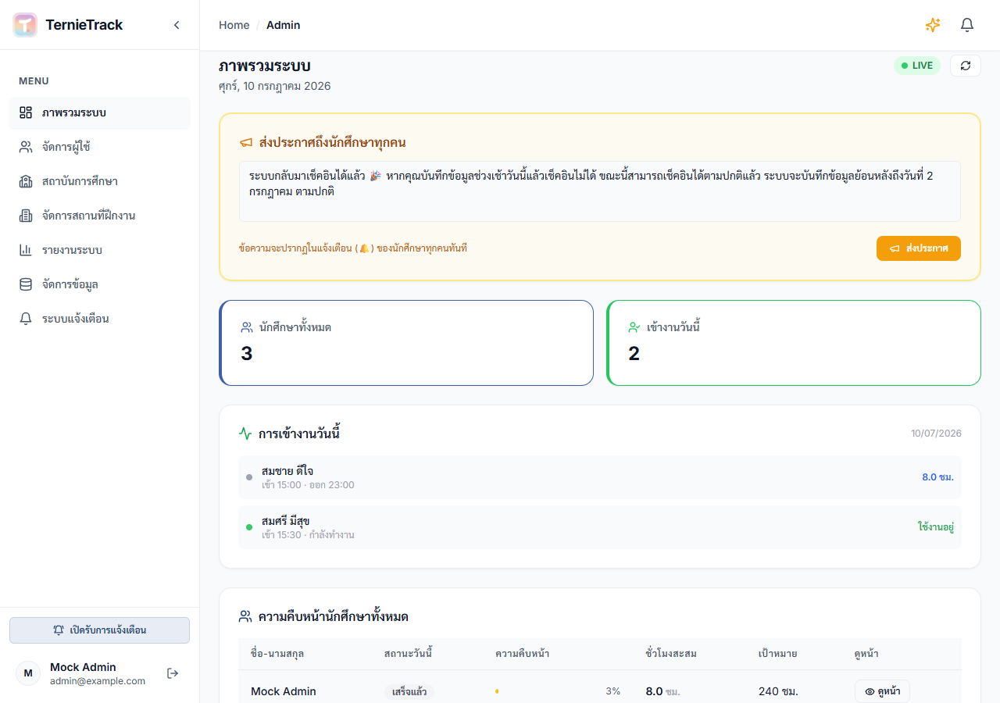
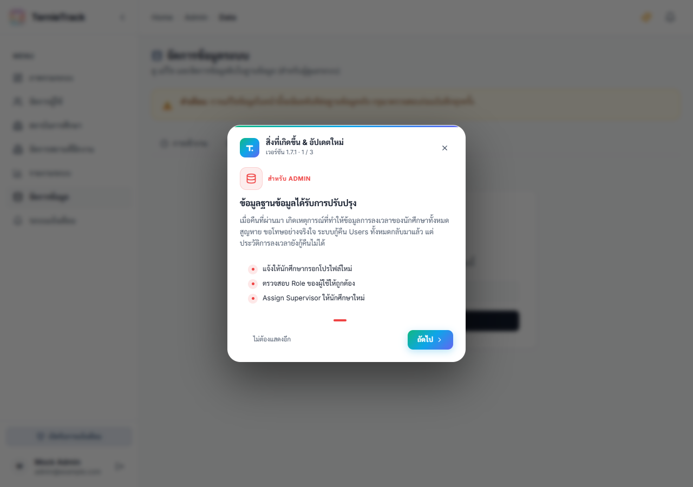

---
pdf_options:
  format: A4
  margin:
    top: 25mm
    right: 25mm
    bottom: 25mm
    left: 25mm
  displayHeaderFooter: true
  headerTemplate: ""
  footerTemplate: "
หน้า  / 
"
style: |
  @import url('https://fonts.googleapis.com/css2?family=Sarabun:ital,wght@0,300;0,400;0,500;0,600;0,700;1,300;1,400;1,500;1,600;1,700&display=swap');
  
  body {
    font-family: 'Sarabun', sans-serif;
    font-size: 16px;
    line-height: 1.6;
    color: #2d3748;
  }
  
  h1 {
    font-size: 26px;
    color: #1a365d;
    text-align: center;
    margin-top: 1cm;
    margin-bottom: 2cm;
    font-weight: 700;
  }
  
  h2 {
    font-size: 20px;
    color: #2b6cb0;
    margin-top: 1.5cm;
    margin-bottom: 0.8cm;
    border-bottom: 2px solid #e2e8f0;
    padding-bottom: 0.3cm;
    page-break-before: always;
    font-weight: 600;
  }
  
  h3 {
    font-size: 16px;
    color: #2d3748;
    margin-top: 0.8cm;
    margin-bottom: 0.4cm;
    font-weight: 600;
  }
  
  p, li {
    margin-bottom: 0.3cm;
  }
  
  img {
    max-width: 90%;
    max-height: 15cm;
    display: block;
    margin: 0.8cm auto;
    border: 1px solid #cbd5e0;
    border-radius: 6px;
    box-shadow: 0 4px 6px rgba(0, 0, 0, 0.05);
    page-break-inside: avoid;
  }
  
  /* Avoid page breaks inside paragraphs and lists where possible */
  p, li, blockquote {
    page-break-inside: avoid;
  }
  
  /* Heading page-break fixes */
  h1, h2, h3, h4, h5, h6 {
    page-break-after: avoid;
  }
  
  hr {
    border: 0;
    border-top: 1px solid #e2e8f0;
    margin: 1.5cm 0;
  }
  
  .page-number {
    font-size: 10px;
    color: #a0aec0;
    text-align: center;
  }
---

  <h1 style="font-size: 36px; color: #1a365d; margin-bottom: 10px;">คู่มือการใช้งานระบบ</h1>
  <h2 style="font-size: 26px; color: #2b6cb0; border-bottom: none; padding-bottom: 0; page-break-before: auto;">TernieTrack (Internship Time Tracking System)</h2>

## สารบัญ (Table of Contents)

1. [บทนำ (Introduction)](#1-บทนำ-introduction)
2. [การเริ่มต้นใช้งานระบบ (Getting Started)](#2-การเริ่มต้นใช้งานระบบ-getting-started)
3. [คู่มือสำหรับนักศึกษา (Student)](#3-คู่มือสำหรับนักศึกษา-student)
4. [คู่มือสำหรับพี่เลี้ยง (Mentor)](#4-คู่มือสำหรับพี่เลี้ยง-mentor)
5. [คู่มือสำหรับอาจารย์นิเทศ (Supervisor)](#5-คู่มือสำหรับอาจารย์นิเทศ-supervisor)
6. [คู่มือสำหรับผู้ดูแลระบบ (Admin)](#6-คู่มือสำหรับผู้ดูแลระบบ-admin)

## 1. บทนำ (Introduction)
ระบบ TernieTrack ถูกพัฒนาขึ้นเพื่อบริหารจัดการและติดตามเวลาการปฏิบัติงานของนักศึกษาฝึกงาน โดยลดขั้นตอนการใช้เอกสารแบบดั้งเดิม ผู้ใช้งานสามารถบันทึกเวลาการปฏิบัติงาน เขียนบันทึกประจำวัน และส่งขออนุมัติชั่วโมงการทำงานผ่านระบบออนไลน์ได้ 

ระบบประกอบด้วยผู้ใช้งาน 4 ระดับ ได้แก่:
1. **นักศึกษา (Student):** ผู้ใช้งานหลักในการบันทึกเวลาปฏิบัติงานและส่งรายงาน
2. **พี่เลี้ยง (Mentor):** ตัวแทนจากสถานประกอบการ ทำหน้าที่ตรวจสอบและอนุมัติการทำงาน
3. **อาจารย์นิเทศ (Supervisor):** ตัวแทนจากสถานศึกษา ทำหน้าที่ติดตามความคืบหน้าของนักศึกษา
4. **ผู้ดูแลระบบ (Admin):** ผู้บริหารจัดการสิทธิ์ผู้ใช้งานและข้อมูลระบบ

---

## 2. การเริ่มต้นใช้งานระบบ (Getting Started)

### 2.1 การลงทะเบียนเข้าใช้งาน (Registration)
1. ไปที่หน้าแรกของระบบและเลือกเมนู **"สมัครสมาชิก" (Register)**
2. กรอกข้อมูลส่วนบุคคล ได้แก่ **ชื่อ-นามสกุล**, **อีเมล** และกำหนด **รหัสผ่าน** (ความยาวอย่างน้อย 6 ตัวอักษร)
3. กดยืนยันการสมัครสมาชิก 
*(หมายเหตุ: บัญชีที่ลงทะเบียนใหม่จะได้รับสิทธิ์เริ่มต้นเป็น "นักศึกษา" เสมอ)*

### 2.2 การเข้าสู่ระบบ (Login)
1. ไปที่เมนู **"เข้าสู่ระบบ" (Login)**
2. ระบุอีเมลและรหัสผ่านที่ได้ลงทะเบียนไว้
3. เมื่อเข้าสู่ระบบสำเร็จ ระบบจะแสดงหน้าแดชบอร์ด (Dashboard) ตามระดับสิทธิ์ของผู้ใช้งาน

---

## 3. คู่มือสำหรับนักศึกษา (Student)

### 3.1 การบันทึกเวลาเข้า-ออกงาน (Time Attendance)
* **เวลาปฏิบัติงานมาตรฐาน:** 08:00 - 16:00 น.
* **การบันทึกเวลาเข้างาน (Clock In):** เมื่อถึงสถานประกอบการ ให้คลิกปุ่ม **"เช็คอินเข้างาน"** 
* **การบันทึกเวลาออกงาน (Clock Out):** เมื่อสิ้นสุดการปฏิบัติงานในแต่ละวัน ให้คลิกปุ่ม **"เช็คเอาท์เลิกงาน"** 
*(หมายเหตุ: หากบันทึกเวลาเข้างานก่อนเวลา 08:00 น. ระบบจะพิจารณาให้เป็นผู้ที่เข้าปฏิบัติงานก่อนเวลา และมอบตราสัญลักษณ์ Early Bird ให้โดยอัตโนมัติ)*

### 3.2 การเขียนบันทึกการปฏิบัติงานประจำวัน (Daily Log)
หลังจากบันทึกเวลาเข้างานเรียบร้อยแล้ว นักศึกษาต้องดำเนินการดังนี้:
1. เลือกระดับความพึงพอใจในการปฏิบัติงานของวันนั้น
2. พิมพ์สรุปรายละเอียดการปฏิบัติงานประจำวัน (จำกัดความยาวไม่เกิน 500 ตัวอักษร)
3. คลิก **"บันทึกสมุดงาน"** (สามารถปรับปรุงข้อมูลได้ตลอดเวลาก่อนสิ้นสุดวัน)
4. **การแก้ไขบันทึกย้อนหลัง:** หากต้องการแก้ไขหรือดูบันทึกของวันก่อนหน้า สามารถเลื่อนลงมาที่ตาราง "ประวัติการเข้างาน" และคลิกที่ปุ่ม **"รูปหนังสือ (แก้ไข/ดู บันทึกประจำวัน)"** ในคอลัมน์จัดการ เพื่อแสดงหน้าต่างสำหรับการแก้ไขบันทึกประจำวันของวันนั้นย้อนหลังได้โดยเฉพาะ

### 3.3 การยื่นคำร้องขอลาหยุด (Leave Request)
1. ไปที่เมนู **"แจ้งลา ป่วย/กิจ"**
2. เลือกประเภทการลา (ลาป่วย หรือ ลากิจ) และระบุวันที่ต้องการลา
3. ระบุเหตุผลการลาโดยละเอียด แล้วคลิก **"ส่งคำขอลา"**

### 3.4 ตารางการปฏิบัติงาน (Schedule)
นักศึกษาก็สามารถตรวจสอบกิจกรรมหรือตารางงานที่พี่เลี้ยงกำหนดไว้ และสามารถสร้างกิจกรรมส่วนบุคคลเพิ่มเติมได้ในเมนูนี้ เพื่อบริหารจัดการเวลาทำงานให้มีประสิทธิภาพยิ่งขึ้น

### 3.5 การจัดการข้อมูลส่วนตัว (Profile)
นักศึกษาสามารถเข้ามาอัปเดตข้อมูลส่วนบุคคล เปลี่ยนรหัสผ่าน หรืออัปโหลดรูปภาพโปรไฟล์ใหม่ได้ผ่านเมนู **"โปรไฟล์ของฉัน"**

---

## 4. คู่มือสำหรับพี่เลี้ยง (Mentor)

พี่เลี้ยงมีหน้าที่ดูแลนักศึกษาในสถานประกอบการ โดยมีสิทธิ์การใช้งานดังนี้:

### 4.1 แดชบอร์ดภาพรวม (Dashboard)
**การติดตามภาพรวม:** ตรวจสอบความคืบหน้าและชั่วโมงสะสมของนักศึกษาในการดูแลผ่านหน้าแดชบอร์ด

### 4.2 การอนุมัติคำร้องขอลา (Leave Approvals)
ตรวจสอบและพิจารณาอนุมัติคำร้องการลาหยุดของนักศึกษา หากปฏิเสธการลาสามารถระบุเหตุผลเพิ่มเติมได้

### 4.3 การกำหนดตารางงาน (Schedule)
มอบหมายภาระงาน นัดหมายประชุม หรือจัดตารางกิจกรรมล่วงหน้าให้นักศึกษาผ่านเมนู **"ตารางงาน"** เพื่อให้นักศึกษาได้เตรียมตัว

---

## 5. คู่มือสำหรับอาจารย์นิเทศ (Supervisor)

อาจารย์นิเทศสามารถติดตามความคืบหน้าของนักศึกษาในความดูแลได้ดังนี้:

### 5.1 แดชบอร์ดภาพรวม (Dashboard)
**การตรวจสอบภาพรวม:** ติดตามสถานะและเปรียบเทียบชั่วโมงการปฏิบัติงานของนักศึกษาแต่ละรายบุคคลในความดูแล

### 5.2 การออกรายงานผล (Reports)
สามารถสร้างและดาวน์โหลดรายงานผลการปฏิบัติงาน โดยคลิกปุ่ม **"พิมพ์รายงาน"** ระบบจะสร้างเอกสารข้อมูลที่มีรูปแบบเป็นทางการสำหรับการรายงานผลทางวิชาการ

---

## 6. คู่มือสำหรับผู้ดูแลระบบ (Admin)

ผู้ดูแลระบบมีหน้าที่บริหารจัดการข้อมูลระบบระดับโครงสร้าง:

### 6.1 แดชบอร์ดภาพรวมระบบ (Dashboard)
ติดตามข้อมูลสถิติการใช้งานระบบ ภาพรวมของกิจกรรมทั้งหมด และแนวโน้มการใช้งานของผู้ใช้ทุกกลุ่ม

### 6.2 การจัดการผู้ใช้งาน (User Management)
เพิ่ม แก้ไข ระงับสิทธิ์การใช้งานบัญชีผู้ใช้ จัดการรหัสผ่าน หรือนำเข้าข้อมูลบัญชีทีละหลายรายการผ่านไฟล์ Excel ได้

### 6.3 การจัดสรรข้อมูลการฝึกงาน (Placements)
กำหนดความสัมพันธ์ระหว่าง นักศึกษา สถานประกอบการ พี่เลี้ยง และอาจารย์นิเทศ ผ่านเมนู **"จับคู่นักศึกษา"** เพื่อให้ข้อมูลในระบบแสดงผลและเชื่อมโยงกันอย่างถูกต้อง

### 6.4 การแก้ไขข้อมูลการเข้างาน (Attendance Edit)
แอดมินสามารถเข้าไปที่หน้าแดชบอร์ดของนักศึกษา (โดยใช้โหมดมุมมอง View As) แล้วกดปุ่มรูปหนังสือ 📖 ในตารางประวัติการเข้างาน เพื่อแก้ไข "เวลาเข้า-ออกงาน" และ "ข้อความบันทึกประจำวัน" ย้อนหลังของนักศึกษาได้โดยตรง โดยหน้าต่างแก้ไขสำหรับแอดมินจะมีฟิลด์สีแดงพิเศษสำหรับการกรอกเปลี่ยนเวลาเช็คอินและเช็คเอาท์เพื่อคำนวณชั่วโมงงานใหม่ให้โดยอัตโนมัติ

### 6.5 การจัดการฐานข้อมูลและบันทึกเวลาที่ขาดหาย (Data Manager & Missing Logs)
แอดมินสามารถเข้าถึงระบบจัดการฐานข้อมูล (Data Manager) เพื่อแก้ไขประวัติโดยตรง และสามารถเพิ่มเวลาที่นักศึกษาลืมบันทึกย้อนหลังผ่านแท็บพิเศษได้:
1. ไปที่หน้า **"จัดการข้อมูล"** และคลิกแท็บ **"เวลาที่ขาดหาย"**
2. ระบุรหัสผ่าน `admin123` ในหน้าต่างความปลอดภัยเพื่อปลดล็อกฟีเจอร์
3. คลิกปุ่ม **"+ เพิ่มข้อมูลใหม่"** เพื่อเปิดหน้าต่างบันทึกเวลาและหมายเหตุการเข้างานที่ขาดหายไป ข้อมูลจะคำนวณและบันทึกเข้าสู่ระบบจริงทันที

---
*เอกสารฉบับนี้ถูกจัดทำขึ้นเพื่อเป็นแนวทางประกอบการใช้งานระบบ TernieTrack สำหรับผู้ใช้งานทุกระดับ*
