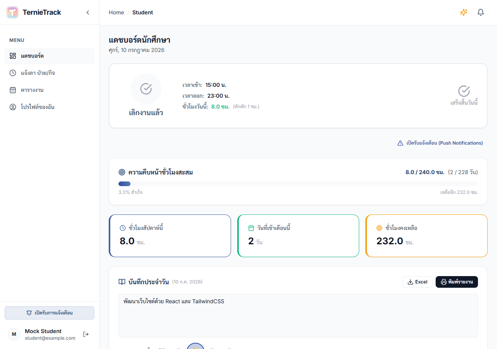
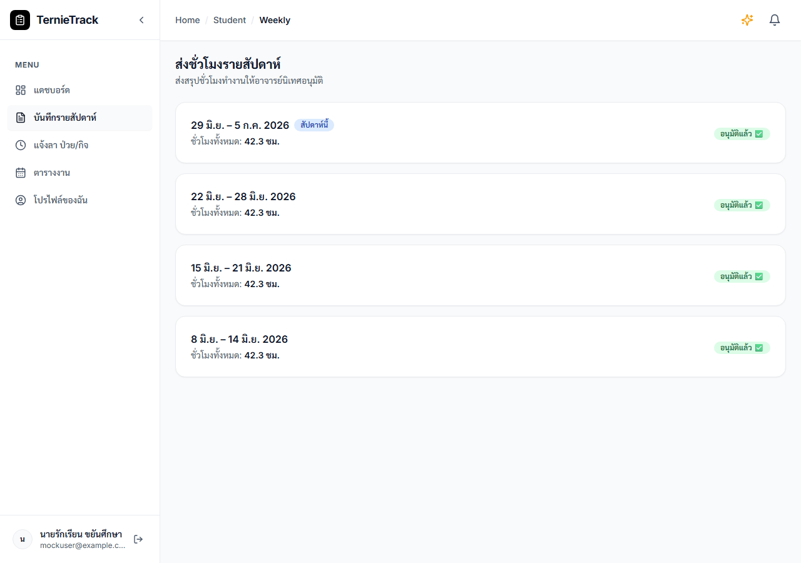
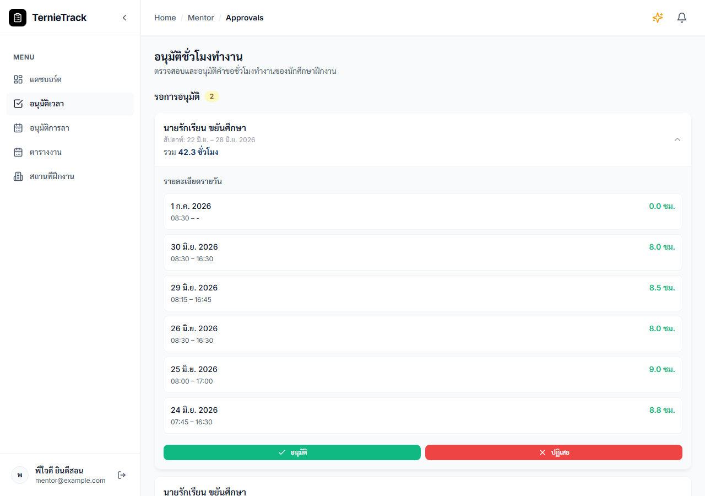
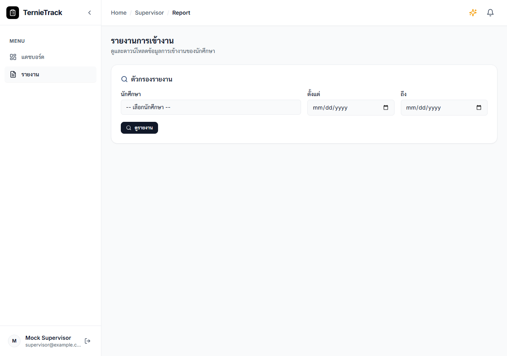
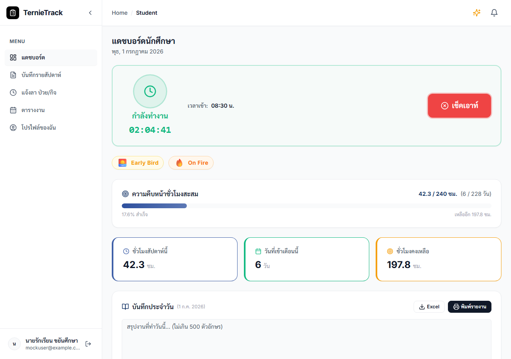

# คู่มือการใช้งานระบบ InternTrack (Internship Time Tracking System)

---

## 1. บทนำ (Introduction)
ระบบ InternTrack ถูกพัฒนาขึ้นเพื่อบริหารจัดการและติดตามเวลาการปฏิบัติงานของนักศึกษาฝึกงาน โดยลดขั้นตอนการใช้เอกสารแบบดั้งเดิม ผู้ใช้งานสามารถบันทึกเวลาการปฏิบัติงาน เขียนบันทึกประจำวัน และส่งขออนุมัติชั่วโมงการทำงานผ่านระบบออนไลน์ได้ 

ระบบประกอบด้วยผู้ใช้งาน 4 ระดับ ได้แก่:
1. **นักศึกษา (Student):** ผู้ใช้งานหลักในการบันทึกเวลาปฏิบัติงานและส่งรายงาน
2. **พี่เลี้ยง (Mentor):** ตัวแทนจากสถานประกอบการ ทำหน้าที่ตรวจสอบและอนุมัติการทำงาน
3. **อาจารย์นิเทศ (Supervisor):** ตัวแทนจากสถานศึกษา ทำหน้าที่ติดตามความคืบหน้าของนักศึกษา
4. **ผู้ดูแลระบบ (Admin):** ผู้บริหารจัดการสิทธิ์ผู้ใช้งานและข้อมูลระบบ

---

## 2. การเริ่มต้นใช้งานระบบ (Getting Started)

### 2.1 การลงทะเบียนเข้าใช้งาน (Registration)
1. ไปที่หน้าแรกของระบบและเลือกเมนู **"สมัครสมาชิก" (Register)**
2. กรอกข้อมูลส่วนบุคคล ได้แก่ **ชื่อ-นามสกุล**, **อีเมล** และกำหนด **รหัสผ่าน** (ความยาวอย่างน้อย 6 ตัวอักษร)
3. กดยืนยันการสมัครสมาชิก 
*(หมายเหตุ: บัญชีที่ลงทะเบียนใหม่จะได้รับสิทธิ์เริ่มต้นเป็น "นักศึกษา" เสมอ)*

### 2.2 การเข้าสู่ระบบ (Login)
1. ไปที่เมนู **"เข้าสู่ระบบ" (Login)**
2. ระบุอีเมลและรหัสผ่านที่ได้ลงทะเบียนไว้
3. เมื่อเข้าสู่ระบบสำเร็จ ระบบจะแสดงหน้าแดชบอร์ด (Dashboard) ตามระดับสิทธิ์ของผู้ใช้งาน

---

## 3. คู่มือสำหรับนักศึกษา (Student)

### 3.1 การบันทึกเวลาเข้า-ออกงาน (Time Attendance)
* **เวลาปฏิบัติงานมาตรฐาน:** 08:00 - 16:00 น.
* **การบันทึกเวลาเข้างาน (Clock In):** เมื่อถึงสถานประกอบการ ให้คลิกปุ่ม **"เช็คอินเข้างาน"** 
* **การบันทึกเวลาออกงาน (Clock Out):** เมื่อสิ้นสุดการปฏิบัติงานในแต่ละวัน ให้คลิกปุ่ม **"เช็คเอาท์เลิกงาน"** 
*(หมายเหตุ: หากบันทึกเวลาเข้างานก่อนเวลา 08:00 น. ระบบจะพิจารณาให้เป็นผู้ที่เข้าปฏิบัติงานก่อนเวลา และมอบตราสัญลักษณ์ Early Bird ให้โดยอัตโนมัติ)*

### 3.2 การเขียนบันทึกการปฏิบัติงานประจำวัน (Daily Log)
หลังจากบันทึกเวลาเข้างานเรียบร้อยแล้ว นักศึกษาต้องดำเนินการดังนี้:
1. เลือกระดับความพึงพอใจในการปฏิบัติงานของวันนั้น
2. พิมพ์สรุปรายละเอียดการปฏิบัติงานประจำวัน (จำกัดความยาวไม่เกิน 500 ตัวอักษร)
3. คลิก **"บันทึกสมุดงาน"** (สามารถปรับปรุงข้อมูลได้ตลอดเวลาก่อนสิ้นสุดวัน)
4. **การแก้ไขบันทึกย้อนหลัง:** หากต้องการแก้ไขหรือดูบันทึกของวันก่อนหน้า สามารถเลื่อนลงมาที่ตาราง "ประวัติการเข้างาน" และคลิกที่ปุ่ม **"รูปหนังสือ (แก้ไข/ดู บันทึกประจำวัน)"** ในคอลัมน์จัดการ

### 3.3 การขออนุมัติชั่วโมงการปฏิบัติงาน (Weekly Approval)
นักศึกษาต้องดำเนินการส่งสรุปชั่วโมงการปฏิบัติงานรายสัปดาห์ เพื่อให้พี่เลี้ยงตรวจสอบ:
1. ไปที่เมนู **"ส่งชั่วโมงรายสัปดาห์"**
2. ตรวจสอบความถูกต้องของชั่วโมงการทำงาน และคลิกปุ่ม **"ส่งขออนุมัติ"** 
3. สถานะจะเปลี่ยนเป็นรอการพิจารณา หากพี่เลี้ยงปฏิเสธการอนุมัติ นักศึกษาต้องดำเนินการแก้ไขตามหมายเหตุและส่งคำขอใหม่อีกครั้ง

### 3.4 การยื่นคำร้องขอลาหยุด (Leave Request)
1. ไปที่เมนู **"แจ้งลา ป่วย/กิจ"**
2. เลือกประเภทการลา (ลาป่วย หรือ ลากิจ) และระบุวันที่ต้องการลา
3. ระบุเหตุผลการลาโดยละเอียด แล้วคลิก **"ส่งคำขอลา"**

### 3.5 ตารางการปฏิบัติงาน (Schedule)
นักศึกษาสามารถตรวจสอบกิจกรรมหรือตารางงานที่พี่เลี้ยงกำหนดไว้ และสามารถสร้างกิจกรรมส่วนบุคคลเพิ่มเติมได้ในเมนูนี้

---

## 4. คู่มือสำหรับพี่เลี้ยง (Mentor)

พี่เลี้ยงมีหน้าที่ดูแลนักศึกษาในสถานประกอบการ โดยมีสิทธิ์การใช้งานดังนี้:
* **การติดตามภาพรวม:** ตรวจสอบความคืบหน้าและชั่วโมงสะสมของนักศึกษาในการดูแลผ่านหน้าแดชบอร์ด (Dashboard)
* **การอนุมัติเวลาปฏิบัติงาน:** ไปที่เมนู **"อนุมัติเวลาฝึกงาน"** เพื่อตรวจสอบบันทึกรายวันของนักศึกษา และดำเนินการ **"อนุมัติ"** หรือ **"ปฏิเสธ"**
* **การอนุมัติคำร้องขอลา:** ตรวจสอบและพิจารณาอนุมัติคำร้องการลาหยุดของนักศึกษา
* **การกำหนดตารางงาน:** มอบหมายภาระงานหรือจัดตารางกิจกรรมล่วงหน้าให้นักศึกษาผ่านเมนู **"ตารางงาน"**

---

## 5. คู่มือสำหรับอาจารย์นิเทศ (Supervisor)

อาจารย์นิเทศสามารถติดตามความคืบหน้าของนักศึกษาในความดูแลได้ดังนี้:
* **การตรวจสอบภาพรวม:** ติดตามสถานะและเปรียบเทียบชั่วโมงการปฏิบัติงานของนักศึกษาแต่ละรายบุคคล
* **การออกรายงานผล:** สามารถสร้างและดาวน์โหลดรายงานผลการปฏิบัติงาน โดยคลิกปุ่ม **"พิมพ์รายงาน"** ระบบจะสร้างเอกสารข้อมูลที่มีรูปแบบเป็นทางการสำหรับการรายงานผลทางวิชาการ

---

## 6. คู่มือสำหรับผู้ดูแลระบบ (Admin)

ผู้ดูแลระบบมีหน้าที่บริหารจัดการข้อมูลระบบระดับโครงสร้าง:
* **การจัดการผู้ใช้งาน:** เพิ่ม แก้ไข ระงับสิทธิ์การใช้งานบัญชีผู้ใช้ หรือนำเข้าข้อมูลบัญชีทีละหลายรายการผ่านไฟล์ Excel
* **การจัดสรรข้อมูลการฝึกงาน (Placements):** กำหนดความสัมพันธ์ระหว่าง นักศึกษา สถานประกอบการ พี่เลี้ยง และอาจารย์นิเทศ ผ่านเมนู **"จับคู่นักศึกษา"** เพื่อให้ข้อมูลในระบบแสดงผลอย่างถูกต้อง
* **การแก้ไขข้อมูลการเข้างาน (Attendance Edit):** แอดมินสามารถเข้าไปที่หน้าแดชบอร์ดของนักศึกษา (โดยใช้โหมดมุมมอง View As) แล้วกดปุ่มรูปหนังสือ 📖 ในตารางประวัติการเข้างาน เพื่อแก้ไข "เวลาเข้า-ออกงาน" และ "ข้อความบันทึกประจำวัน" ย้อนหลังของนักศึกษาได้โดยตรง
* **การจัดการฐานข้อมูล (Data Manager):** เข้าถึงระบบข้อมูลเชิงลึกเพื่อตรวจสอบและปรับปรุงความคลาดเคลื่อนของข้อมูลโดยตรง

---
*เอกสารฉบับนี้ถูกจัดทำขึ้นเพื่อเป็นแนวทางประกอบการใช้งานระบบ InternTrack สำหรับผู้ใช้งานทุกระดับ*
