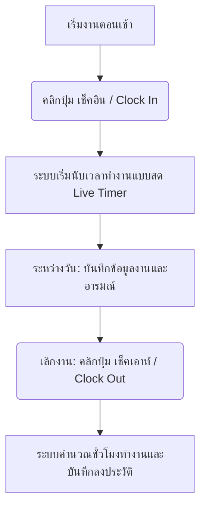
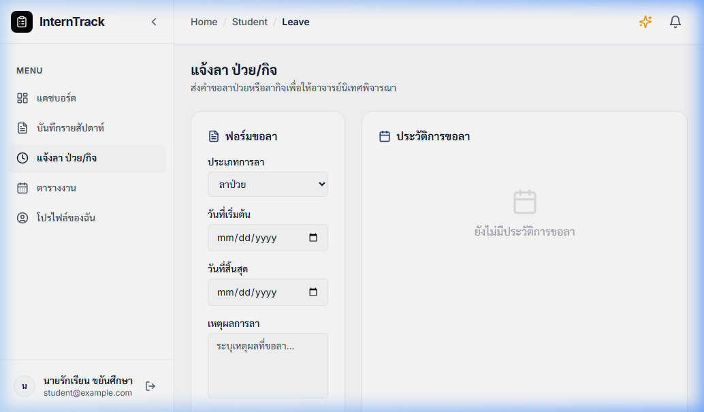
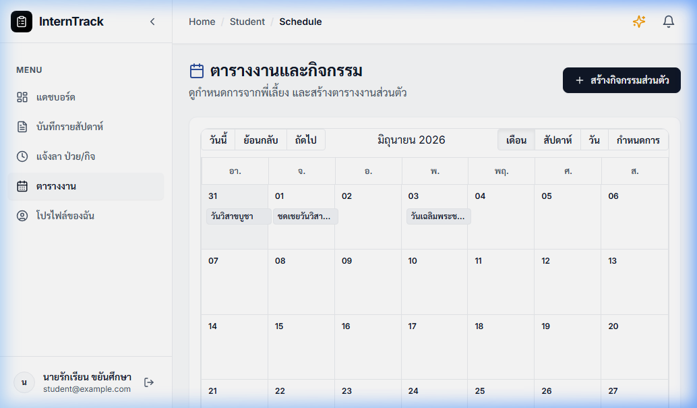
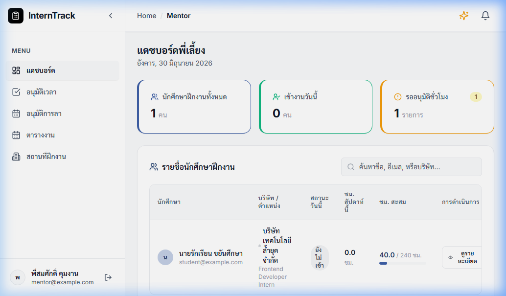
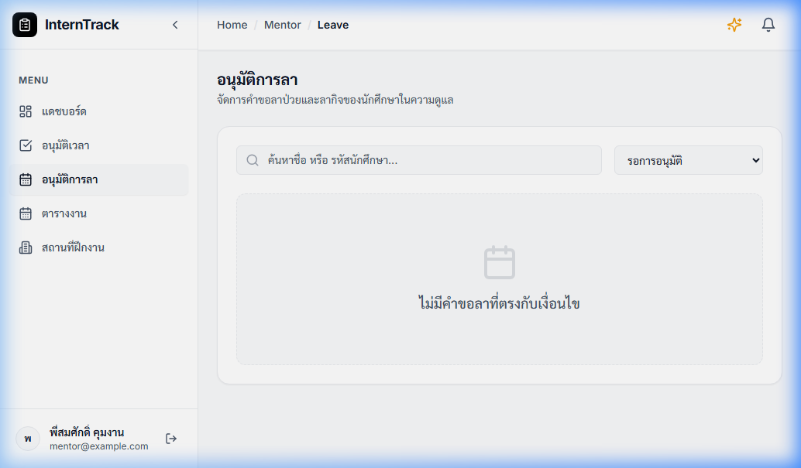
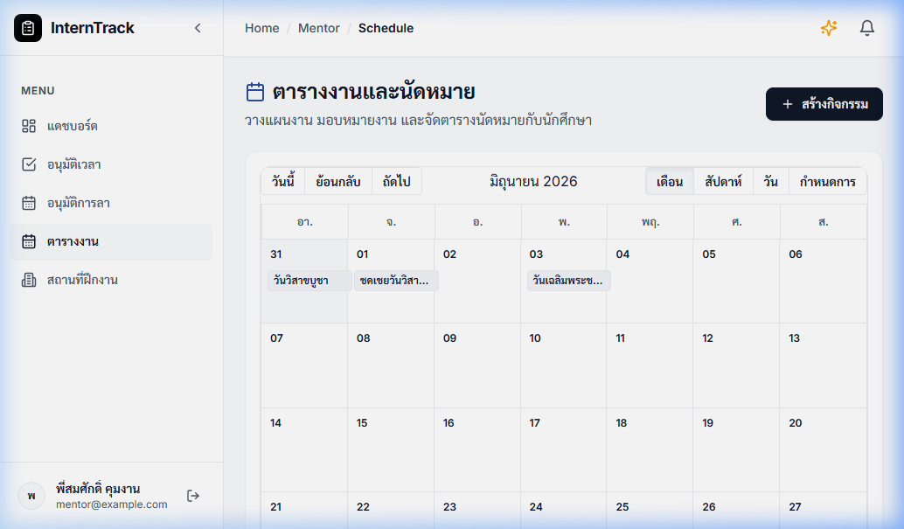
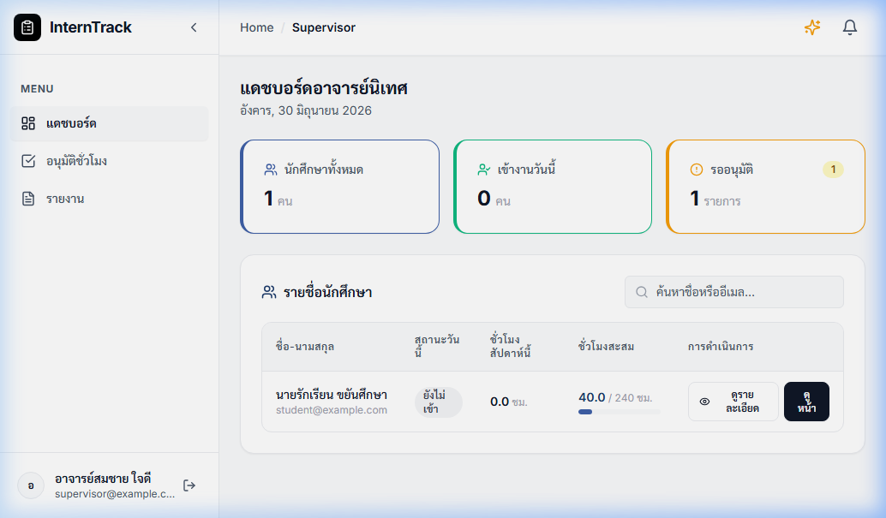
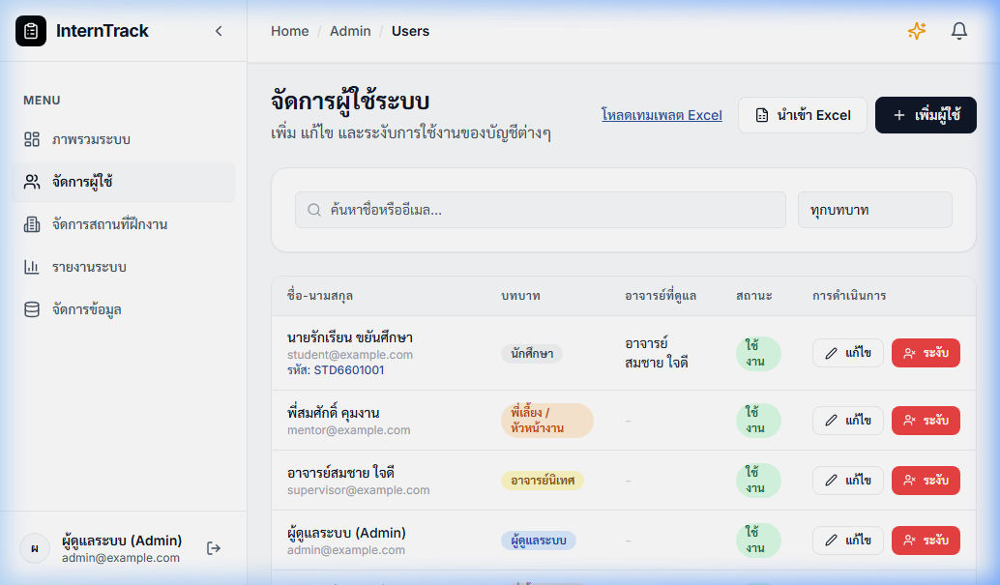
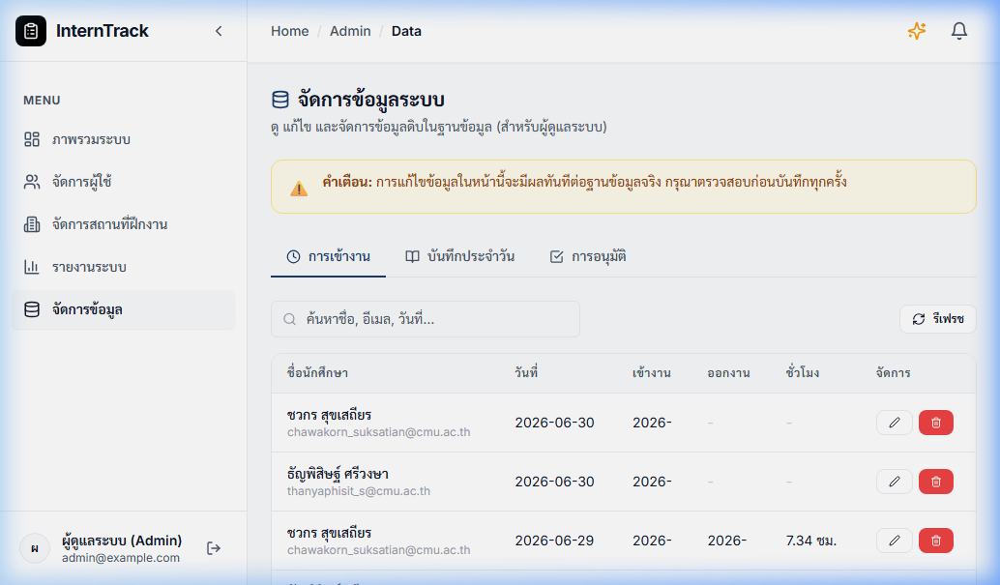
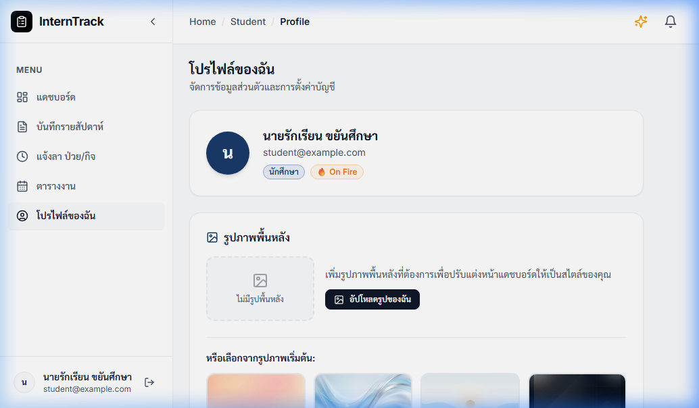

# 🎓 คู่มือการใช้งานระบบ InternTrack
ระบบบันทึกและติดตามเวลาการฝึกงาน (Internship Time Tracking System) แบบละเอียด

---

## 📌 สารบัญ (Table of Contents)
1. [ภาพรวมของระบบ (System Overview)](#1-ภาพรวมของระบบ-system-overview)
2. [บทบาทผู้ใช้งานในระบบ (User Roles)](#2-บทบาทผู้ใช้งานในระบบ-user-roles)
3. [คู่มือสำหรับนักศึกษา (Student User Guide)](#3-คู่มือสำหรับนักศึกษา-student-user-guide)
4. [คู่มือสำหรับพี่เลี้ยง / หัวหน้างาน (Mentor User Guide)](#4-คู่มือสำหรับพี่เลี้ยง--หัวหน้างาน-mentor-user-guide)
5. [คู่มือสำหรับอาจารย์นิเทศ (Supervisor User Guide)](#5-คู่มือสำหรับอาจารย์นิเทศ-supervisor-user-guide)
6. [คู่มือสำหรับผู้ดูแลระบบ (Admin User Guide)](#6-คู่มือสำหรับผู้ดูแลระบบ-admin-user-guide)
7. [ฟีเจอร์การปรับแต่งและความสนุก (Customization & Gamification)](#7-ฟีเจอร์การปรับแต่งและความสนุก-customization--gamification)
8. [การแลกเปลี่ยนและนำเข้า/ส่งออกข้อมูล (Excel Import/Export)](#8-การแลกเปลี่ยนและนำเข้าส่งออกข้อมูล-excel-importexport)
9. [โครงสร้างความปลอดภัยและความเป็นส่วนตัว (Data Security & RLS)](#9-โครงสร้างความปลอดภัยและความเป็นส่วนตัว-data-security--rls)

---

## 1. ภาพรวมของระบบ (System Overview)

**InternTrack** เป็นเว็บแอปพลิเคชันสำหรับบันทึกและติดตามเวลาการฝึกงาน ออกแบบมาเพื่อลดภาระงานเอกสารในการลงเวลาและการเขียนบันทึกประจำวันของนักศึกษาฝึกงาน พร้อมระบบอนุมัติชั่วโมงออนไลน์แบบ Real-time ที่เชื่อมโยงระหว่าง **นักศึกษา (Student)**, **พี่เลี้ยงในสถานประกอบการ (Mentor)**, **อาจารย์นิเทศจากสถาบันการศึกษา (Supervisor)** และ **ผู้ดูแลระบบ (Admin)**

### เทคโนโลยีเบื้องหลัง (Technology Stack)
* **Frontend:** React 18 + Vite 5 + Tailwind CSS v3
* **Routing:** React Router v6 (ควบคุมการเข้าถึงตามบทบาทผู้ใช้งาน)
* **Charts:** Recharts (สำหรับแสดงกราฟความคืบหน้าของนักศึกษา)
* **Backend & Database:** Supabase (PostgreSQL + Supabase Auth + Storage)
* **Real-time Notifications:** ระบบแจ้งเตือนในแอปพลิเคชัน

---

## 2. บทบาทผู้ใช้งานในระบบ (User Roles)

ระบบประกอบด้วย 4 บทบาทหลัก ซึ่งจะมีสิทธิ์เข้าใช้งานหน้าจอและปุ่มกดต่างกันตามบทบาท:

| บทบาท (Role) | คำอธิบายสิทธิ์และหน้าที่ในระบบ |
| :--- | :--- |
| **👨‍🎓 นักศึกษา (Student)** | ลงเวลาเข้า-ออกงาน, เขียนบันทึกประจำวัน, ส่งอนุมัติชั่วโมงรายสัปดาห์, ยื่นคำขอลาป่วย/ลากิจ, กำหนดตารางงานส่วนตัว และตั้งค่าโปรไฟล์/รูปพื้นหลัง |
| **👨‍🏫 พี่เลี้ยง (Mentor)** | ตรวจสอบการลงเวลาและสมุดบันทึกของนักศึกษาในบริษัท, อนุมัติ/ปฏิเสธชั่วโมงรายสัปดาห์, อนุมัติการลาป่วย/ลากิจ, จัดตารางงานมอบหมายให้กับนักศึกษา และเข้าดูหน้าจอนักศึกษาผ่านโหมด View As |
| **👩‍🏫 อาจารย์นิเทศ (Supervisor)** | ติดตามความคืบหน้าชั่วโมงฝึกงานของนักศึกษาในกลุ่ม, อนุมัติชั่วโมงรายสัปดาห์, เรียกดูประวัติการเข้างานแบบละเอียด, ส่งออกรายงานผลการฝึกงาน และจำลองหน้าจอมุมมองนักศึกษาผ่านโหมด View As |
| **🛠️ ผู้ดูแลระบบ (Admin)** | จัดการผู้ใช้งาน (เพิ่ม/แก้ไข/ปิดใช้งาน), จับคู่ข้อมูลการฝึกงาน (นักศึกษา + พี่เลี้ยง + อาจารย์นิเทศ + บริษัท), ตรวจสอบสถิติระบบ, และแก้ไขข้อมูลดิบผ่านระบบ Data Manager |

---

## 3. คู่มือสำหรับนักศึกษา (Student User Guide)

### 3.1 การลงทะเบียนและการเข้าสู่ระบบ
1. เข้าไปที่หน้าลงทะเบียน (`/register`) กรอกข้อมูล **ชื่อ-นามสกุล**, **อีเมล**, และ **รหัสผ่าน (อย่างน้อย 6 ตัวอักษร)**
2. หลังจากลงทะเบียนสำเร็จ ให้เข้าสู่ระบบที่หน้าล็อกอิน (`/login`)
3. ระบบจะนำไปยังหน้าแดชบอร์ดนักศึกษาโดยอัตโนมัติ

> [!NOTE]
> บัญชีที่ลงทะเบียนใหม่ผ่านหน้าเว็บจะได้รับบทบาทเป็น **นักศึกษา (Student)** เสมอ หากต้องการเปลี่ยนบทบาทอื่นต้องให้ผู้ดูแลระบบ (Admin) ดำเนินการผ่านแผงควบคุม

---

### 3.2 แดชบอร์ดหลักและการเช็คอิน-เช็คเอาท์ (Check-in / Check-out)
หน้าแดชบอร์ดมีระบบบันทึกเวลาทำงานที่ออกแบบมาให้ใช้งานง่ายพร้อมตัวจับเวลาแบบวินาที (Live Timer)

* **การเช็คอิน (Clock In):**
  1. เมื่อเริ่มปฏิบัติงาน ให้เปิดหน้าแดชบอร์ดแล้วคลิกปุ่มสีเขียว **"เช็คอินเข้างาน"**
  2. ระบบจะบันทึกเวลาเริ่มต้นปัจจุบันไว้ และเริ่มตัวจับเวลาบนหน้าจอ
* **การเช็คเอาท์ (Clock Out):**
  1. เมื่อสิ้นสุดการทำงาน ให้คลิกปุ่มสีส้ม **"เช็คเอาท์เลิกงาน"**
  2. ระบบจะแสดงป๊อปอัปให้ยืนยันการลงเวลาเลิกงาน
  3. หลังจากยืนยัน ระบบจะคำนวณชั่วโมงทำงานจริงในวันนั้น (เช่น 8.00 ชม.) และหยุดตัวนับเวลา
  4. ตัวเลขชั่วโมงนี้จะสะสมเข้าไปยังเป้าหมายชั่วโมงฝึกงานทันที (ปกติเริ่มต้นที่ 240 ชั่วโมง)

> [!WARNING]
> **ข้อจำกัดในการเช็คอิน:**
> * หากเช็คอินก่อนเวลา **06:00 น.** หรือหลัง **22:00 น.** ระบบจะมีข้อความแจ้งเตือนสีส้มเพื่อเตือนว่าเป็นการทำงานนอกเวลาปกติ
> * นักศึกษาสามารถเช็คอินได้เพียง **1 ครั้งต่อวัน** เท่านั้น หากเช็คเอาท์แล้วจะไม่สามารถเช็คอินซ้ำในวันเดียวกันได้

---

### 3.3 การเขียนบันทึกการทำงานประจำวัน (Daily Work Log)
เมื่อเช็คอินแล้ว นักศึกษาควรเขียนบันทึกการปฏิบัติงานประจำวันเพื่อให้พี่เลี้ยงและอาจารย์นิเทศตรวจสอบ:
1. เลื่อนลงมาที่หัวข้อ **"บันทึกการฝึกงานวันนี้"**
2. เลือก **อารมณ์ประจำวัน (Daily Mood)**: ดีมาก (Great), ปกติ (Neutral), แย่ (Bad), เครียด (Stressed), หรือมีความสุข (Happy)
3. พิมพ์รายละเอียดงานลงในช่องข้อความ (ความยาวสูงสุดไม่เกิน **500 ตัวอักษร**)
4. คลิกปุ่ม **"บันทึกสมุดงาน"** 
5. ระบบจะแสดงสถานะบันทึกสำเร็จพร้อมเครื่องหมายถูกสีเขียว นักศึกษาสามารถแก้ไขบันทึกนี้ได้ตลอดเวลาจนกว่าจะสิ้นสุดวัน

---

### 3.4 การส่งอนุมัติชั่วโมงรายสัปดาห์ (Weekly Submit)
ชั่วโมงทำงานสะสมที่นักศึกษาลงเวลาไว้ จะต้องได้รับการอนุมัติจากพี่เลี้ยงหรืออาจารย์เพื่อรับรองความถูกต้อง:
1. ไปที่เมนู **"ส่งชั่วโมงรายสัปดาห์"** ในแถบเมนูด้านซ้าย
2. ระบบจะดึงประวัติชั่วโมงทำงานย้อนหลัง **4 สัปดาห์ล่าสุด**
3. หากสัปดาห์ใดมีชั่วโมงทำงานมากกว่า 0 และยังไม่ได้ส่งอนุมัติ จะปรากฏปุ่ม **"ส่งขออนุมัติ"**
4. เมื่อนักศึกษาคลิกส่งคำขอ ระบบจะส่งข้อความแจ้งเตือนไปที่พี่เลี้ยงและอาจารย์โดยตรง และเปลี่ยนสถานะเป็น **"รอการอนุมัติ"**
5. เมื่อได้รับการอนุมัติแล้ว สถานะจะเปลี่ยนเป็น **"อนุมัติแล้ว ✅"** (พร้อมเอฟเฟกต์พลุกระดาษฉลอง 🎉)
6. หากถูกปฏิเสธ สถานะจะเปลี่ยนเป็น **"ถูกปฏิเสธ ❌"** และจะปรากฏกล่องข้อความสีแดงระบุ **"หมายเหตุ/เหตุผลที่ปฏิเสธ"** จากอาจารย์หรือพี่เลี้ยง นักศึกษาต้องประสานงานแก้ไขข้อมูลและส่งขออนุมัติใหม่อีกครั้ง

---

### 3.5 การแจ้งลา ป่วย/กิจ (Leave Request)
หากนักศึกษาต้องการลาหยุดงาน สามารถยื่นเอกสารการลาออนไลน์ผ่านระบบได้:
1. ไปที่เมนู **"แจ้งลา ป่วย/กิจ"**
2. เลือกประเภทการลา: **ลาป่วย (Sick)** หรือ **ลากิจ (Personal)**
3. เลือกวันที่เริ่มต้นและวันที่สิ้นสุดการลา
4. กรอกเหตุผลการลาอย่างละเอียด เช่น "มีไข้สูง ไปพบแพทย์" หรือ "มีธุระสำคัญกับครอบครัวที่ต่างจังหวัด"
5. คลิกปุ่ม **"ส่งคำขอลา"**
6. คำขอจะถูกส่งไปยังพี่เลี้ยงและอาจารย์นิเทศเพื่อพิจารณา และประวัติคำขอจะแสดงในตารางด้านขวาพร้อมสถานะ (รออนุมัติ / อนุมัติแล้ว / ถูกปฏิเสธ)

---

### 3.6 ตารางงานและกำหนดการส่วนตัว (Student Schedule)
นักศึกษาสามารถบริหารจัดการเวลาของตนเองได้ผ่านระบบปฏิทิน:
* **การดูตาราง:** เข้าสู่เมนู **"ตารางงานและกำหนดการ"** ระบบจะแสดงปฏิทินในรูปแบบ รายเดือน/รายสัปดาห์/รายวัน
* **การสร้างกิจกรรมส่วนตัว:**
  1. คลิกปุ่ม **"สร้างกิจกรรมส่วนตัว"** หรือคลิกช่องวันที่บนปฏิทิน
  2. ระบุหัวข้อการทำงาน (เช่น ทำรายงานสรุป, พบอาจารย์ที่ปรึกษา), วันและเวลาเริ่มต้น/สิ้นสุด, เลือกสีป้ายกำกับ, และรายละเอียดเพิ่มเติม
  3. คลิก **"บันทึก"** กิจกรรมส่วนตัวนี้มีเพียงตัวนักศึกษาเองและพี่เลี้ยงที่สามารถเห็นได้
* **ตารางงานจากพี่เลี้ยง (Locked Event):** กิจกรรมใดๆ ที่พี่เลี้ยงสร้างขึ้นและมอบหมายให้นักศึกษา จะแสดงเป็นสีฟ้าพร้อมไอคอนแม่กุญแจ 🔒 นักศึกษาสามารถเปิดอ่านรายละเอียดได้ แต่จะไม่สามารถแก้ไขหรือลบกิจกรรมนี้ได้

---

## 4. คู่มือสำหรับพี่เลี้ยง / หัวหน้างาน (Mentor User Guide)

พี่เลี้ยงเป็นผู้ดูแลนักศึกษาโดยตรงในสถานที่ปฏิบัติงานจริง มีหน้าที่ตรวจสอบ ดูแลตารางงาน และลงความเห็นชอบใบลา

### 4.1 แดชบอร์ดพี่เลี้ยงและการติดตาม interns
* เมื่อเข้าสู่ระบบในบทบาทพี่เลี้ยง หน้าจอจะแสดงยอดรวมสรุปของนักศึกษาภายใต้ความดูแล เช่น จำนวนนักศึกษาทั้งหมด, จำนวนคนที่มาปฏิบัติงานในวันนี้ และจำนวนชั่วโมงสะสมรวม
* แผนภูมิแท่งเปรียบเทียบชั่วโมงสะสมของนักศึกษาแต่ละคน เพื่อให้เห็นความคืบหน้าอย่างชัดเจน

---

### 4.2 การอนุมัติชั่วโมงทำงานรายสัปดาห์ (Weekly Approvals)
1. ไปที่เมนู **"อนุมัติเวลาฝึกงาน"**
2. รายการคำขอที่รอนุมัติจะแสดงแยกตามชื่อนักศึกษาและช่วงสัปดาห์
3. **การตรวจสอบเชิงลึก:** คลิกที่กล่องคำขอเพื่อขยายดูรายละเอียด ระบบจะแสดงตารางลงเวลาแบบรายวัน (วันจันทร์-วันอาทิตย์) เวลาเข้า-ออกจริง, จำนวนชั่วโมงในวันนั้น รวมถึงข้อความบันทึกงานประจำวันและอารมณ์ของนักศึกษา
4. **การตัดสินใจ:**
   * **อนุมัติ (Approve):** คลิกปุ่มสีเขียวเพื่ออนุมัติชั่วโมงทำงาน ระบบจะแจ้งเตือนนักศึกษาว่าชั่วโมงผ่านการรับรองแล้ว
   * **ปฏิเสธ (Reject):** คลิกปุ่มสีแดง ระบบจะแสดงป๊อปอัปให้ระบุเหตุผลในการปฏิเสธ (เช่น "ชั่วโมงวันพุธไม่ถูกต้อง กรุณาตรวจสอบบันทึกเวลาใหม่") ข้อมูลนี้จะส่งกลับไปให้นักศึกษาแก้ไข

---

### 4.3 การจัดการและอนุมัติการลา (Leave Approvals)
1. ไปที่เมนู **"อนุมัติการลา"**
2. ระบบจะแสดงตารางการขอลาของนักศึกษาทั้งหมด
3. พี่เลี้ยงสามารถคลิกปุ่มเครื่องหมายถูกสีเขียว (อนุมัติ) หรือปุ่มกากบาทสีแดง (ปฏิเสธ) เพื่อจัดการใบลาของนักศึกษาได้ทันที และระบบจะส่งการแจ้งเตือนผลลัพธ์กลับไปยังนักศึกษา

---

### 4.4 การวางตารางงานให้นักศึกษา (Mentor Schedule)
1. เข้าไปที่เมนู **"ตารางงาน"**
2. คลิกปุ่ม **"สร้างกิจกรรม/ตารางงาน"**
3. พิมพ์หัวข้องาน เช่น "ร่วมประชุมทีมประจำสัปดาห์", "ส่งรายงานชิ้นที่ 1"
4. **ขอบเขตผู้รับงาน:** เลือกมอบหมายให้นักศึกษาเฉพาะรายบุคคล หรือเว้นว่างไว้เพื่อให้กิจกรรมนี้มีผลกับนักศึกษาฝึกงานทุกคนในความดูแล
5. กำหนดช่วงเวลา เลือกสีป้ายกำกับ และพิมพ์รายละเอียดคำอธิบาย
6. กิจกรรมนี้จะไปปรากฏในปฏิทินของนักศึกษาโดยอัตโนมัติและไม่สามารถแก้ไขได้โดยนักศึกษา

---

### 4.5 โหมดจำลองมุมมองนักศึกษา (View As Student)
* ในหน้ารายละเอียดข้อมูลนักศึกษา (`Student Detail`) พี่เลี้ยงสามารถคลิกปุ่ม **"ดูในฐานะนักศึกษา" (View As Student)**
* ระบบจะเปิดหน้าแดชบอร์ดนักศึกษาจำลองขึ้นมา ช่วยให้พี่เลี้ยงเห็นสิ่งที่นักศึกษาเห็นทุกประการ เพื่อการช่วยเหลือหรือตรวจสอบความถูกต้องหน้าจอได้อย่างแม่นยำ (หน้าจอจะมีแถบสีส้มด้านบนเตือนว่าเป็นโหมดอ่านอย่างเดียว 🔒 ไม่สามารถทำธุรกรรมแทนได้)

---

## 5. คู่มือสำหรับอาจารย์นิเทศ (Supervisor User Guide)

อาจารย์นิเทศเน้นการประเมินภาพรวมความก้าวหน้าและการออกรายงานผลเพื่อบันทึกเกรดหรือหน่วยกิต

### 5.1 แดชบอร์ดและการตรวจสอบรายตัว
* แดชบอร์ดของอาจารย์จะจำแนกความคืบหน้าของนักศึกษาทุกคนเป็นเปอร์เซ็นต์เทียบกับเป้าหมายชั่วโมงฝึกงาน (เช่น 240 ชม.)
* หากต้องการดูข้อมูลของนักศึกษาคนใดเป็นพิเศษ สามารถคลิกที่ชื่อเพื่อเปิดหน้า **Student Detail** ซึ่งจะแสดงปฏิทินการเข้างาน รายวัน และตารางสรุปทั้งหมดของนักศึกษาคนนั้น

---

### 5.2 การอนุมัติชั่วโมงและการออกรายงาน (Reports)
* **การอนุมัติเวลา:** ทำงานร่วมกับพี่เลี้ยง อาจารย์นิเทศสามารถสลับมาดูหน้า **"อนุมัติชั่วโมง"** เพื่อรับรองความถูกต้องของชั่วโมงทำงานรายสัปดาห์ได้เช่นเดียวกัน
* **การสรุปผลรายงาน (Export Report):**
  1. เข้าสู่เมนู **"รายงานความคืบหน้า" (Progress Report)**
  2. ระบบจะคำนวณและแสดงผลเปอร์เซ็นต์ของจำนวนวันที่มาปฏิบัติงาน, ชั่วโมงเฉลี่ยต่อวัน, และสถานะความสำเร็จ
  3. อาจารย์สามารถสั่งพิมพ์เอกสารรายงานสรุปเป็นกระดาษหรือไฟล์ PDF ได้โดยคลิกปุ่ม **"พิมพ์รายงาน" (Print/Printable Log)** ซึ่งระบบเตรียมสไตล์หน้ากระดาษพิมพ์ (Print-friendly CSS) ที่สวยงาม สะอาดตา เหมาะสำหรับการยื่นฝ่ายวิชาการ

---

## 6. คู่มือสำหรับผู้ดูแลระบบ (Admin User Guide)

ผู้ดูแลระบบมีหน้าที่ดูแลโครงสร้างบัญชีและจัดการการเชื่อมโยงข้อมูลในระบบ

### 6.1 การจัดการผู้ใช้ (User Management)
1. ไปที่เมนู **"จัดการผู้ใช้" (Users)**
2. **การเพิ่มผู้ใช้ทีละราย:** คลิกปุ่ม **"เพิ่มผู้ใช้"** กรอกอีเมล, รหัสผ่านเริ่มต้น, ชื่อ-นามสกุล, และกำหนดบทบาท (นักศึกษา / พี่เลี้ยง / อาจารย์ / แอดมิน)
3. **การปิดใช้งานบัญชี (Suspend):** หากต้องการยกเลิกสิทธิ์ชั่วคราว ให้คลิกไอคอนรูปคนสีแดง (Deactivate) บัญชีนั้นจะไม่สามารถเข้าสู่ระบบได้จนกว่าจะได้รับเปิดใช้งานใหม่อีกครั้ง
4. **บทบาทหลักและบทบาทรอง (Secondary Role):** แอดมินสามารถระบุบทบาทรอง (`secondary_role`) ให้กับอาจารย์นิเทศ เช่น หากอาจารย์ต้องการเข้าใช้งานสิทธิ์ผู้ดูแลระบบเพิ่มด้วย

---

### 6.2 การตั้งค่าคู่ฝึกงานและสถานที่ฝึกงาน (Placements)
เนื่องจากนักศึกษา 1 คนอาจฝึกงานคนละสถานที่และมีพี่เลี้ยงคนละคน แอดมินจะต้องกำหนดเชื่อมโยงที่เมนู **"จับคู่นักศึกษา" (Placements)**:
1. เลือกนักศึกษาที่ต้องการตั้งค่า
2. ระบุ **ชื่อบริษัท**, **แผนก**, และ **ตำแหน่งงาน**
3. เลือก **พี่เลี้ยง (Mentor)** ที่ทำหน้าที่ควบคุมดูแลในสถานประกอบการนั้น
4. เลือก **อาจารย์นิเทศ (Supervisor)** ที่รับผิดชอบนักศึกษา
5. กำหนดวันที่เริ่มฝึกงานและสิ้นสุดการฝึกงาน
6. คลิก **"บันทึกข้อมูลการจัดสรร"**

---

### 6.3 ระบบจัดการข้อมูลดิบ (Data Manager)
แผงควบคุมระดับสูงสำหรับการดูแลความเรียบร้อยของระบบฐานข้อมูลโดยตรง:
* เข้าผ่านเมนู **"ตัวจัดการข้อมูล" (Data Manager)**
* แอดมินสามารถเลือกตารางข้อมูลในระบบได้ทั้งหมด เช่น `users`, `attendance`, `daily_logs`, `weekly_approvals`, `schedules`
* สามารถ ค้นหาข้อมูล, เพิ่มข้อมูลใหม่เข้าไปในตาราง, แก้ไขฟิลด์ หรือลบเรคคอร์ดที่มีปัญหาออก เพื่อแก้ไขความผิดพลาดด้านข้อมูลโดยไม่ต้องเขียนคำสั่ง SQL เอง

---

## 7. ฟีเจอร์การปรับแต่งและความสนุก (Customization & Gamification)

แอปพลิเคชัน InternTrack ออกแบบโดยเน้นประสบการณ์ใช้งานที่ดีและสนุกสนานด้วยระบบสะสมเหรียญตรา (Gamification Badges) และความยืดหยุ่นในการปรับแต่งหน้าจอส่วนตัว

### 7.1 เหรียญรางวัลความมุ่งมั่น (Badges System)
ระบบคำนวณและแจกเหรียญรางวัลให้อัตโนมัติบนหน้าโปรไฟล์และหน้าแรกของนักศึกษา เพื่อสร้างแรงจูงใจในการทำงาน:

| เหรียญตรา (Badge) | ไอคอน | เงื่อนไขการได้รับ |
| :--- | :---: | :--- |
| **Marathoner** | 💯 | เมื่อนักศึกษาสะสมชั่วโมงทำงานฝึกงานรวมครบ **100 ชั่วโมงขึ้นไป** |
| **Early Bird** | 🌅 | เมื่อมีการเช็คอินบันทึกเวลาทำงานก่อนเวลา **08:30 น.** อย่างน้อยหนึ่งครั้ง |
| **Weekend Warrior** | 👑 | เมื่อมีการเช็คอินปฏิบัติงานในวันหยุดสุดสัปดาห์ **(วันเสาร์ หรือ วันอาทิตย์)** |
| **On Fire** | 🔥 | เมื่อมีการปฏิบัติงานอย่างต่อเนื่องตั้งแต่ **5 วันขึ้นไป** ภายในเดือนปัจจุบัน |

---

### 7.2 การเลือกพื้นหลังและอัปโหลดรูปประจำตัว (Backgrounds & Avatars)
ผู้ใช้งานสามารถปรับแต่งบรรยากาศของหน้าเว็บบอร์ดได้ตามสไตล์ตนเองผ่านหน้า **"โปรไฟล์ของฉัน" (Profile)**
* **รูปประจำตัว (Avatar):** คลิกปุ่มอัปโหลดรูปภาพประจำตัวเพื่อเปลี่ยนรูปภาพวงกลมบนเมนู ระบบจะส่งรูปภาพไปเก็บยัง Supabase Storage Bucket แบบจำกัดสิทธิ์ผู้ดูแลเฉพาะตัว
* **ภาพพื้นหลังระบบ (System Background):** สามารถเลือกรูปภาพพื้นหลังที่ระบบมีให้เลือก 4 โทนสีมาตรฐาน ได้แก่:
  1. *Warm Pastel* (โทนสีอบอุ่น พาสเทลน่ารัก)
  2. *Cool Blue* (โทนสีฟ้า สะอาดตาทันสมัย)
  3. *Minimal Landscape* (รูปทิวทัศน์เรียบง่าย สบายตา)
  4. *Dark Mode Glow* (ภาพเรืองแสงโทนสีเข้มสำหรับผู้ที่ชอบหน้าจอถนอมสายตา)
  หรือ สามารถกดปุ่ม **"อัปโหลดพื้นหลังเอง"** เพื่อใส่ภาพส่วนตัวของคุณได้ตามต้องการ

---

### 7.3 การเปลี่ยนธีมเว็บแอป (Theme Switcher)
ที่ปุ่มไอคอนจานสีหรือดวงจันทร์บน **TopBar (แถบเมนูด้านบนสุด)** ผู้ใช้สามารถเปลี่ยนสไตล์ของอินเทอร์เฟซส่วนกลางได้ทันที โดยแบ่งออกเป็น 3 รูปแบบธีมหลัก:
1. **Classic Theme:** เน้นขอบที่ชัดเจน การจัดแต่งแบบดั้งเดิมที่คุ้นเคย
2. **Minimal Theme:** เน้นความเบาบาง สะอาดตา ลดเส้นขอบ เพิ่มพื้นที่ว่าง
3. **Dark Theme:** หน้าจอสีมืด (ถนอมสายตา) เหมาะสำหรับการใช้งานในสภาวะแสงน้อย

---

## 8. การแลกเปลี่ยนและนำเข้า/ส่งออกข้อมูล (Excel Import/Export)

เพื่อให้เกิดความยืดหยุ่นในการทำงานร่วมกับโปรแกรม Microsoft Excel หรือ Google Sheets ระบบจึงรองรับฟังก์ชันดังนี้:

### 8.1 การส่งออกรายงานเวลาฝึกงานของนักศึกษา (Student Export)
นักศึกษาสามารถดาวน์โหลดบันทึกประวัติการฝึกงานทั้งหมดออกมาเป็นเอกสาร Excel ได้ด้วยการคลิกปุ่ม **"ดาวน์โหลดรายงาน Excel"** บนหน้าแดชบอร์ดหลัก โดยไฟล์ที่ดาวน์โหลดมาจะมีโครงสร้างแถวข้อมูลดังนี้:
* *หัวกระดาษ:* ระบุชื่อ-นามสกุล และรหัสนักศึกษาชัดเจน
* *คอลัมน์ข้อมูล:* วันที่ | เวลาเช็คอิน | เวลาเช็คเอาท์ | จำนวนชั่วโมงทำงาน | ข้อความบันทึกงานประจำวัน | สถานะ

---

### 8.2 การนำเข้าข้อมูลบัญชีผู้ใช้งานแบบกลุ่มโดยแอดมิน (Admin Excel Import)
ในหน้าจอจัดการผู้ใช้ แอดมินสามารถนำรายชื่อบัญชีนักศึกษาหรืออาจารย์เข้าระบบได้พร้อมกันร้อยรายผ่านไฟล์ Excel:
1. เตรียมไฟล์ Excel (.xlsx) ให้มีหัวตาราง (Header Columns) ตรงกับตัวเลือกข้อใดข้อหนึ่งดังนี้:
   * **อีเมล** หรือ *Email*
   * **ชื่อ-นามสกุล** หรือ *Name* หรือ *full_name*
   * **รหัสผ่าน** หรือ *Password* (ถ้าไม่มี ระบบจะตั้งค่าเริ่มต้นให้เป็น `password123`)
   * **บทบาท** หรือ *Role* (student / mentor / supervisor / admin)
   * **รหัสนักศึกษา** หรือ *Student Code*
2. คลิกปุ่ม **"นำเข้า Excel"** ในหน้าจัดการผู้ใช้ แล้วเลือกไฟล์ที่เตรียมไว้
3. ระบบจะทยอยลงทะเบียนบัญชีผู้ใช้เข้าสู่ Supabase Auth และแทรกลงฐานข้อมูลทีละแถวโดยอัตโนมัติ พร้อมแสดงแถบความคืบหน้า (Progress Bar) และรายการแจ้งเตือนความผิดพลาดหากพบบัญชีอีเมลซ้ำซ้อนในระบบ

---

## 9. โครงสร้างความปลอดภัยและความเป็นส่วนตัว (Data Security & RLS)

ข้อมูลภายในระบบ InternTrack ถูกปกป้องด้วยกฎการอนุญาตเข้าถึงในระดับแถวข้อมูลของ PostgreSQL (**Row Level Security - RLS**) บน Supabase:

* **ตารางโปรไฟล์ผู้ใช้ (users):** ผู้ใช้ทุกคนอ่านข้อมูลโปรไฟล์ตัวเองได้ แต่สิทธิ์แก้ไขข้อมูลจำกัดเฉพาะแอดมินและเจ้าของโปรไฟล์เท่านั้น
* **ตารางประวัติการเข้างานและสมุดบันทึก (attendance / daily_logs):** นักศึกษาเขียนและอ่านข้อมูลของตัวเองได้เท่านั้น ส่วนอาจารย์นิเทศและพี่เลี้ยงจะได้รับการอนุญาตให้อ่านประวัติได้เฉพาะนักศึกษาที่ถูกจัดสรรให้อยู่ในความดูแลของตน
* **ตารางอนุมัติชั่วโมง (weekly_approvals) & คำขอลา (leave_requests):** เฉพาะอาจารย์นิเทศและพี่เลี้ยงที่เชื่อมโยงกับนักศึกษารายนั้นๆ เท่านั้นที่จะมีสิทธิ์มองเห็นคำขอและปรับปรุงแก้ไขสถานะอนุมัติ/ปฏิเสธได้
* **ภาพและไฟล์ในระบบ:** รูปถ่ายโปรไฟล์และรูปพื้นหลังที่อัปโหลดจะใช้การตรวจสอบสิทธิ์ความปลอดภัยเทียบรหัสผู้ใช้ เจ้าของบัญชีสามารถอัปเดตและลบภาพของตนใน Storage Bucket ได้ แต่บุคคลอื่นจะเข้าถึงภาพได้เฉพาะผ่าน Public URL เท่านั้นเพื่อใช้แสดงผลบนหน้าต่างโปรแกรม

---

*จัดทำขึ้นเพื่อให้การประสานงานฝึกประสบการณ์วิชาชีพเป็นไปด้วยความสะดวกรวดเร็วและเป็นระบบดิจิทัล 100%*
